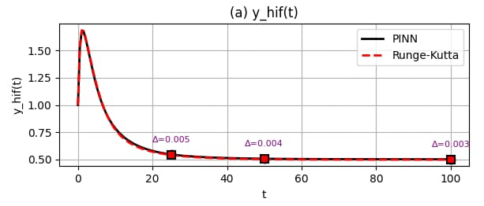

# Simulating the Dynamics of Programmed Cell Death 🧬


This repository contains the source code, analysis scripts, and documentation for the paper **"Simulating the Dynamics of Programmed Cell Death,"** a project focused on the comprehensive evaluation of numerical and machine learning methods for solving an Ordinary Differential Equation (ODE) model of apoptosis.

---

## 📖 Table of Contents
* [Overview](#-overview)
* [The Apoptosis Model](#-the-apoptosis-model)
* [Methods Implemented](#-methods-implemented)
* [Project Structure](#-project-structure)
* [How to Run the Analyses](#-how-to-run-the-analyses)
* [Key Results and Visualizations](#-key-results-and-visualizations)
* [Authors](#-authors)
* [License](#-license)
* [Acknowledgments](#-acknowledgments)

---

## 🔭 Overview

Apoptosis, or programmed cell death, is a fundamental biological process. Its disruption can lead to severe diseases like cancer and neurodegeneration. Mathematical models, particularly systems of ODEs, are essential for understanding the intricate cellular mechanisms that govern this process.

This project dives deep into the core of computational biology by exploring a critical question: **How does the choice of a numerical solver impact the accuracy and efficiency of a biological simulation?**

We implement and compare four distinct solvers to analyze their performance on a well-established six-variable ODE model of apoptosis. The goal is to provide a clear, hands-on benchmark of their accuracy, stability, and computational trade-offs, offering insights for both classical and modern simulation approaches.

---

## 🔬 The Apoptosis Model

The project is based on the six-variable ODE model proposed by Laise et al., which describes the concentration dynamics of key molecular players in the apoptosis pathway:

| Variable | Description                  | Role in Apoptosis             |
| :------- | :--------------------------- | :---------------------------- |
| **HIF-1**  | Hypoxia-inducible factor     | Responds to low oxygen stress |
| **O2**     | Oxygen                       | A critical metabolic component|
| **p300**   | Coactivator protein          | Interacts with HIF-1 and p53  |
| **p53**    | Tumor suppressor protein     | A key regulator of cell fate  |
| **Caspase**| Executioner proteins         | The primary drivers of cell death |
| **K+**     | Potassium ions               | Ion flux is a hallmark of apoptosis |

The full system of six coupled, non-linear ODEs can be found in the accompanying paper. The dynamics capture how these components interact to decide whether a cell lives or dies.

---

## 📂 Project Structure
```
.
├── Graphs/      # Output graphs from the RK4 analysis, RKF45 analysis, Euler analysis and PINN analysis
│
├── Code/      # Script to analyze methods
│
├── Paper/                  # The final PDF paper
├── report.pdf                  # The LaTeX source for the report
│
├── requirements.txt            # Required Python libraries
├── LICENSE                     # MIT License file
└── README.md                   # This file
```
---

## 🚀 How to Run the Analyses

### Prerequisites
- Python 3.7+
- A virtual environment is recommended.
- Install all required Python libraries with a single command:
  ```bash
  pip install -r requirements.txt
  ```

## 🛠️ Methods Logic

### 1. Runge-Kutta-Fehlberg (RKF45) Method ⚙️

#### Logic
The RKF45 is a modern, **adaptive step-size** solver. Its logic is based on the concept of an "embedded" method. At each step, it calculates two solutions simultaneously: a 4th-order estimate and a more accurate 5th-order estimate, using a shared set of function evaluations for efficiency. The difference between these two estimates provides a direct measure of the local error. This error is then used in a feedback loop:
-   If the error is too large, the step is rejected, the step size `h` is reduced, and the step is re-calculated.
-   If the error is acceptable, the step is taken, and `h` may be increased for the next step.
This adaptive control ensures the simulation maintains high accuracy while being computationally efficient.

---

### 2. 4th-Order Runge-Kutta (RK4) Method 📈

#### Logic
The RK4 method is a high-accuracy, fixed-step solver that dramatically improves upon the Euler method. Its core logic involves sampling the slope at **four strategic points** within each time step: the beginning, two different estimates at the midpoint, and the end. By calculating a weighted average of these four slopes, the RK4 method creates a much more accurate projection that effectively accounts for the solution's curvature. Its error decreases much faster with smaller step sizes ($O(h^4)$), making it a workhorse for non-stiff ODE problems.

---

### 3. Explicit Euler Method 📉

#### Logic
The Euler method is the foundational first-order numerical solver. Its logic is based on making a linear approximation at each time step. It calculates the slope (the derivative) at a known point and takes a small step forward along that tangent line to estimate the next point. While simple and computationally fast, its accuracy is low because it completely ignores the curvature of the solution path, leading to an accumulation of error. It is also only conditionally stable, requiring a very small, fixed step size to avoid divergence.

---

### 4. Physics-Informed Neural Network (PINN) 🧠

#### Logic
The PINN represents a complete paradigm shift from traditional numerical methods. It is a machine learning approach that uses a neural network to learn a **continuous function** that approximates the ODE solution. Its logic is not based on discrete time-stepping. Instead, it is trained by minimizing a composite **loss function** that penalizes two things:
1.  **IC Loss:** The network's output at `t=0` must match the known initial conditions.
2.  **Physics Loss:** The network's derivative (calculated via automatic differentiation) must satisfy the governing ODEs at all points.
By forcing the network to obey the laws of physics defined by the equations, the PINN learns the solution trajectory without being given any pre-computed data points.

## 📊 Key Results and Visualizations

Our analysis confirms that the apoptosis model has a **stable equilibrium attractor**. Regardless of the initial conditions, all solvers converge to the same final state, demonstrating the robustness of the model.

The primary differences lie in the accuracy and efficiency of the solvers. The adaptive RKF45 method provides the most reliable solution, which we use as a baseline to evaluate the others.

#### Visual Comparison of Solver Solutions

The following graph shows a direct visual comparison of the solutions produced by different methods for the `HIF-1` variable. The superiority of the higher-order and adaptive methods is clear.

|||
|||


---

## 👥 Authors

-   **Ziad Osama Ismaill**
-   **Anas Mohamed Abdelghany**
-   **Ahmed Mahmoud Adel**
-   **Hassan Badawy Mohamed**
-   **Mohamed Ehab Ahmed**
-   **Menna Atef Eid**
-   **Engy Mohamed Mahmoud**
-   **Nada Mostafa Kamel**
-   **Saga Sadek Zakaria**

All authors are affiliated with the **Faculty of Engineering, Biomedical Department, Cairo University**.

---

## 📜 License

This project is licensed under the **MIT License**. See the [LICENSE](LICENSE) file for details.

---

## 🙏 Acknowledgments

This work is based on the apoptosis model originally proposed by P. Laise, D. Fanelli, and A. Arcangeli in their 2012 paper, "A dynamical model of apoptosis and its role in tumor progression." We thank them for providing a robust and interesting system for our analysis.
